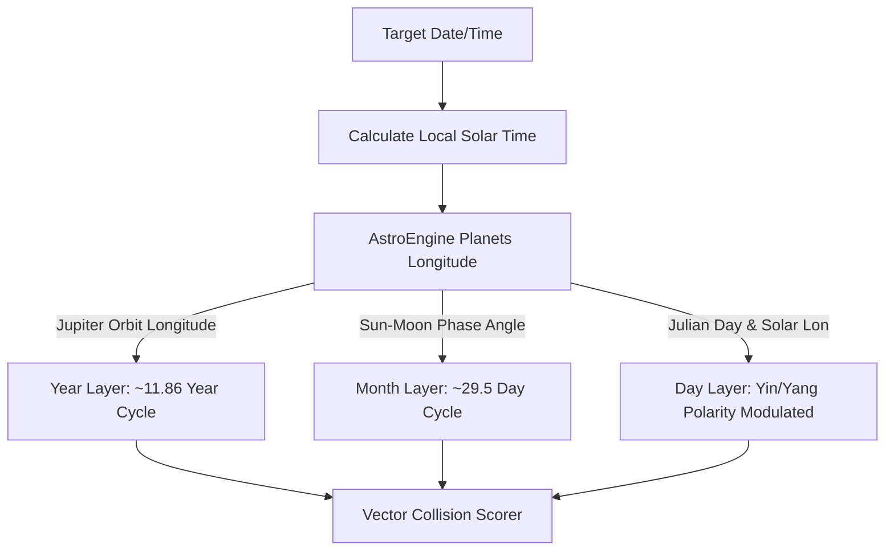

# Portal Direction System - Technical Reference Manual

This document outlines the mathematical, astronomical, and geomantic direction simulation system integrated within the **Bio-Location Simulator Portal** (Destination/Health tab). 

The system bridges state-of-the-art orbital mechanics with traditional East Asian metaphysics (Kigaku/Feng Shui) to map localized environmental and biological resonance vectors.

---

## 1. Directional Reference Frames (真北 vs. 磁北)

The simulator supports toggling between two distinct directional coordinate frames:

1. **True North Base (真北基準)**: Rotated relative to the Earth's geographic rotational axis.
2. **Magnetic North Base (磁北基準 - Default)**: Rotated relative to the Earth's local geomagnetic field vector.

### Local Declination Modeling
Geomagnetic declination ($\theta_D$) varies continuously based on latitude, longitude, elevation, and epoch. The simulator fetches localized geomagnetic vectors via IGRF-13 / World Magnetic Model (WMM) datasets in `getGeomagneticData`.
The system shifts all compass bearings dynamically:
$$\text{Magnetic Bearing} = \text{True Bearing} - \theta_D$$
This ensures that the Kigaku sectors rendered on the SVG map overlay align perfectly with local physical compass needles.

---

## 2. Kigaku 30°/60° Sector Division Model (方位角分割仕様)

Rather than dividing the 360° circle into 8 equal 45° slices, traditional Kigaku divides the horizon based on the 12 Zodiac Earthly Branches (地支), resulting in alternating sector widths:
* **Cardinal Directions (N, E, S, W)**: 30° wide (centered on 0°, 90°, 180°, 270°).
* **Corner Directions (NE, SE, SW, NW)**: 60° wide (centered on 45°, 135°, 225°, 315°).

### Boundary Mapping Matrix (Azimuth Angles)

The directional boundaries are mathematically defined as follows (represented as degrees from North):

| Sector | Direction | Start Azimuth | End Azimuth | Sector Width | Center Angle |
|:---:|:---:|:---:|:---:|:---:|:---:|
| **N** | 北 (子) | 345° | 15° | 30° | 0° (360°) |
| **NE** | 北東 (丑・寅) | 15° | 75° | 60° | 45° |
| **E** | 東 (卯) | 75° | 105° | 30° | 90° |
| **SE** | 南東 (辰・巳) | 105° | 165° | 60° | 135° |
| **S** | 南 (午) | 165° | 195° | 30° | 180° |
| **SW** | 南西 (未・申) | 195° | 255° | 60° | 225° |
| **W** | 西 (酉) | 255° | 285° | 30° | 270° |
| **NW** | 北西 (戌・亥) | 285° | 345° | 60° | 315° |

This mapping is hardcoded and unified across:
- **Frontend Map Layout**: [MagneticMapInner.tsx](file:///c:/Users/ishib/projects/portfolio/my-portfolio/src/components/MagneticMapInner.tsx) (`boundaries = [15, 75, 105, 165, 195, 255, 285, 345]`).
- **Directional HUD/Target Resolution**: [SolarTimeClock.tsx](file:///c:/Users/ishib/projects/portfolio/my-portfolio/src/components/SolarTimeClock.tsx) (`getTargetDirectionInfo`).
- **API Endpoints**: [municipalities-wealth/route.ts](file:///c:/Users/ishib/projects/portfolio/my-portfolio/src/app/api/municipalities-wealth/route.ts) and [rentals/arbitrage/route.ts](file:///c:/Users/ishib/projects/portfolio/my-portfolio/src/app/api/rentals/arbitrage/route.ts) (`getDirectionFromBearing`).

---

## 3. Local Solar Time Correction (地方平均太陽時)

Metaphysical cycles are tied directly to the solar cycle at the observer's exact longitude, rather than civil standard time zones (e.g., JST based on 135°E).

The simulator converts standard clock time to Local Solar Time using the **Equation of Time (EoT)**:
$$\text{Solar Time} = \text{Standard Time} + \text{EoT} + 4 \times (\lambda_{\text{local}} - \lambda_{\text{standard}})$$
Where:
- $\text{EoT}$ is the solar orbital correction in minutes (approximated from the day of the year).
- $\lambda_{\text{local}}$ is the longitude of the location (e.g., Tokyo is 139.6917°E).
- $\lambda_{\text{standard}}$ is the standard meridian longitude (135°E for JST).

This solar time correction shifts the evaluation date slightly (approx. +19 minutes in Tokyo). The corrected date is used to evaluate all astronomical planetary longitudes and Julian Days, avoiding day-boundary calculation errors when selecting dates.

---

## 4. Multi-layer Metaphysical Wave Model

The simulator builds 3 independent frequency layers using high-precision astronomical coordinates provided by `astronomy-engine` (calculating planetary orbits via VSOP87/lunar theory):



1. **Yearly Frequency Layer (年盤)**:
   - Driven by the orbit longitude of Jupiter ($\lambda_{\text{Jupiter}}$, ~11.86-year cycle).
   - Maps $\lambda_{\text{Jupiter}}$ (divided into nine 40° bands) to the central star frequency of the year board.
2. **Monthly Frequency Layer (月盤)**:
   - Driven by the relative phase angle between the Sun and Moon ($\Delta \lambda = \lambda_{\text{Moon}} - \lambda_{\text{Sun}}$, ~29.5-day cycle).
   - Divided into nine 40° phase sectors to map monthly board frequencies.
3. **Daily Frequency Layer (日盤)**:
   - Driven by the continuous Julian Day ($JD$).
   - Polarity shifts (陽遁/陰遁) are triggered by the summer solstice ($\lambda_{\text{Sun}} = 90^\circ$) and winter solstice ($\lambda_{\text{Sun}} = 270^\circ$).

---

## 5. Unified Collision Scorer & Filtering Logic

For any given direction, the simulator aggregates yearly, monthly, and daily frequency statuses (`yStatus`, `mStatus`, `dStatus`) along with local astronomical anomalies.

### Score Summation
```typescript
const totalScore = getLayerScore(yStatus) + getLayerScore(mStatus) + getLayerScore(dStatus) + (isTendo ? 100 : 0);
```

- **Tendo Effect (天道)**: Represents a local gravitational focal vector. If Tendo is in the current direction, it adds $+100$ points, offsetting minor personal negatives.
- **Red Noise (Type I)**: Five-Yellow (五黄殺), Dark-Sword (暗剣殺), or Clash-Ha (破) have a score of $-100$. If not offset by Tendo, they represent extreme spatial risk.
- **Orange Warning (WARNING)**: Occurs when a direction has a minor negative or a major noise (red noise/void) that is partially neutralized by Tendo.
- **Green Optimal (OPTIMAL / OPTIMAL_REGULAR)**: Clear of all noise vectors and resonant with the user's personal Honmei/Getsumei frequency.

### Filtering Unification (`filterLayerData`)
To prevent visual discrepancies between the Map overlay, the HUD table, and the Trend Analytics Heatmap, all components feed raw data through a single unified helper:
```typescript
const filterLayerData = (
  layer: { yearLayer; monthLayer; dayLayer; finalVectors; tendoDirection; doyouState },
  personalStar: StarFrequency,
  getsuMeiStar: StarFrequency | null,
  voidZodiacArray: string[],
  directionFilterMode: 'composite' | 'personal_kigaku' | 'personal_bazi' | 'environmental',
  yBoard: any, mBoard: any, dBoard: any
) => { ... }
```
This isolates specific layers or personal indicators (e.g. Bazi void zones) identically across components, guaranteeing that a direction shown as a warning/lucky on the map is represented with the exact same status and color on the trend rows.
