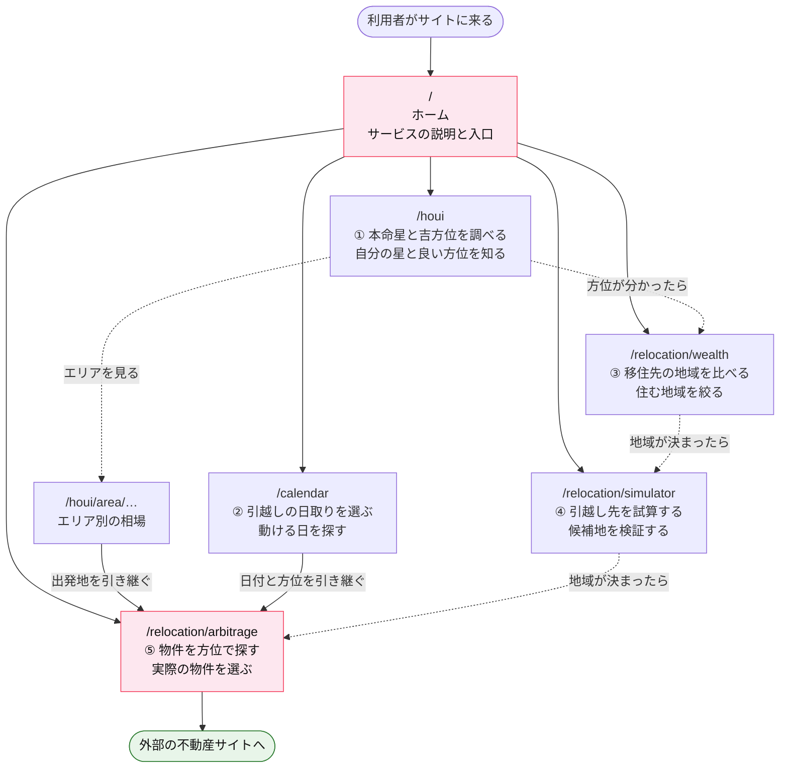
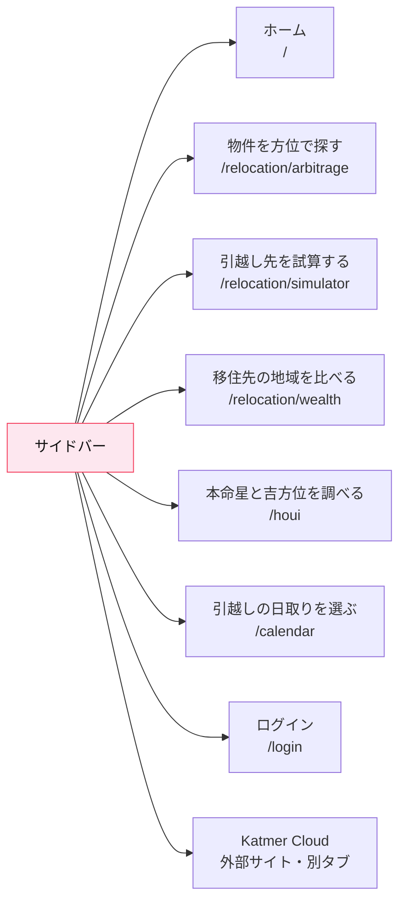
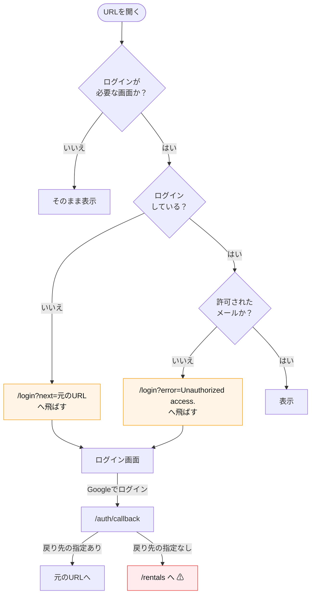
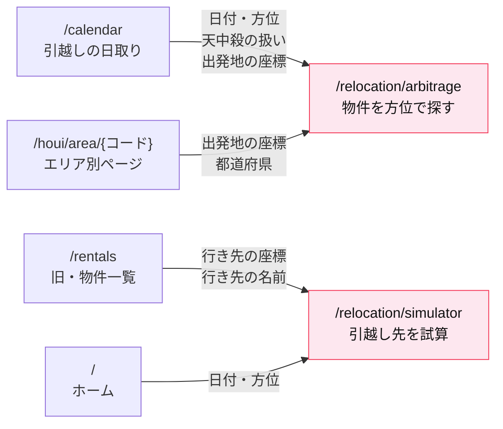
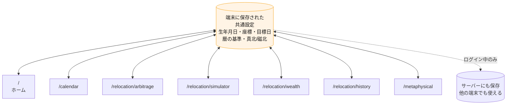

# QA向け 画面仕様書｜Cloud Palette

**このドキュメントは、テストをする方（QAチーム）のために書かれています。**
プログラムの知識がなくても読めるように、専門用語を避けて日本語で説明しています。

| 項目 | 内容 |
|---|---|
| サービス名 | Cloud Palette |
| ひとことで言うと | **引越しの方位とタイミングを決めるサービス** |
| 画面の数 | メニューから行ける画面 **6** ／ 案内ページ **5** ／ 記事ページ **465** ／ メニューに出ない画面 **2** |
| 作成日 | 2026年8月4日 |

---

## 目次

| # | ページ | 内容 |
|---|---|---|
| — | **このページ** | 全体の画面の流れ・画面一覧・テストの進め方 |
| 00 | [全画面に共通する仕様](./00-common.md) | サイドバー、ログインの仕組み、404、テーマ、広告、用語辞典 |
| 01 | [ホーム・ダッシュボード・ログイン・案内ページ](./01-home.md) | `/` `/dashboard` `/login` `/about` `/contact` `/privacy` `/terms` |
| 02 | [物件を方位で探す／旧・物件一覧](./02-arbitrage.md) | `/relocation/arbitrage` `/rentals` |
| 03 | [引越し先を試算する／過去の移動履歴](./03-simulator.md) | `/relocation/simulator` `/relocation/history` |
| 04 | [移住先の地域を比べる](./04-wealth.md) | `/relocation/wealth` |
| 05 | [本命星と吉方位を調べる（465ページ）](./05-houi.md) | `/houi` 配下すべて |
| 06 | [引越しの日取りを選ぶ](./06-calendar.md) | `/calendar` |
| 07 | [削除済みの画面（9画面）](./07-other.md) | すべて404。削除前の仕様のみ |

> **最初に読むもの**：[00. 全画面に共通する仕様](./00-common.md) を先に読んでください。
> どの画面にも共通して効く決まりごと（ログイン、サイドバー、用語）がまとまっています。

---

## 1. このサービスは何をするのか

利用者は「**引越しをしたいが、どこに・いつ動けばよいか分からない**」という状態で来ます。

このサービスは、それを次の2つの軸で決めます。

| 軸 | 内容 |
|---|---|
| **どこへ（方位）** | 九星気学という考え方で、今住んでいる場所から見た「良い向き・悪い向き」を判定する |
| **いつ（タイミング）** | 暦（六曜・天赦日・天中殺など）から、動くのに向いた日を判定する |

さらに、方位だけで決めると生活が成り立たないため、
**家賃の割安さ・地域の所得・駅からの距離**といった現実的な条件も同時に見られるようになっています。

---

## 2. 全体の画面の流れ

### 2-1. 利用者が通る道すじ（メインの流れ）

**実線の矢印**＝画面から画面へ移動でき、**条件が引き継がれる**（重点テスト対象）
**点線の矢印**＝利用者の頭の中での流れ（画面のリンクはあるが、条件は引き継がれない）

### 2-2. サイドバーから行ける画面（全体像）

> **サイドバーには、この8つしか出ません。**
> `/dashboard` や `/rentals` など、他の画面へのリンクはサイドバーにありません。

### 2-3. ログインが要るかどうかの分かれ道

> **⚠ 注意点**：直接ログイン画面からログインした場合、
> 行き先が **`/rentals`**（メニューに出ない古い画面）になります。
> 「ログインしたら見たことのない英語の画面が出た」という報告は、ここが原因です。
> 詳細は [01. ホーム・ログイン](./01-home.md#4-authcallback-ログイン後の受け渡し画面なし) を参照してください。

---

## 3. 画面一覧

### 3-1. 表向きの画面（メニューから行ける）

| URL | 画面名 | ログイン | 仕様書 |
|---|---|---|---|
| `/` | ホーム | 不要 | [01](./01-home.md#1--ホームトップページ) |
| `/relocation/arbitrage` | 物件を方位で探す | 不要 | [02](./02-arbitrage.md) |
| `/relocation/simulator` | 引越し先を試算する | 不要 | [03](./03-simulator.md) |
| `/relocation/wealth` | 移住先の地域を比べる | 不要 | [04](./04-wealth.md) |
| `/houi` | 本命星と吉方位を調べる | 不要 | [05](./05-houi.md) |
| `/calendar` | 引越しの日取りを選ぶ | 不要 | [06](./06-calendar.md) |

### 3-2. 記事ページ群（検索から入ってくる）

**すべてログイン不要です。合計465ページ**（`/houi` 自体もこの465に含まれます）。

| URLのかたち | 画面名 | ページ数 | 仕様書 |
|---|---|---|---|
| `/houi` | 本命星と吉方位の早見表（入口） | 1 | [05](./05-houi.md#4-houi-入口ページ) |
| `/houi/{年}/{星}` | 〇〇年 △△の吉方位と凶方位 | 27 | [05](./05-houi.md#5-houi年星-年ごとのページ) |
| `/houi/{年}/{星}/{月}` | 〇〇年□月 △△の吉方位 | 216 | [05](./05-houi.md#6-houi年星月-月ごとのページ) |
| `/houi/area` | エリア別の方位と家賃相場 | 1 | [05](./05-houi.md#7-houiarea-エリア一覧) |
| `/houi/area/{コード}` | 〇〇市から見た方位別のエリア | 220 | [05](./05-houi.md#8-houiareaコード-エリア詳細) |

### 3-3. 案内ページ

| URL | 画面名 | ログイン | 仕様書 |
|---|---|---|---|
| `/about` | このサイトについて | 不要 | [01](./01-home.md#5-about-このサイトについて) |
| `/contact` | お問い合わせ | 不要 | [01](./01-home.md#6-contact-お問い合わせ) |
| `/privacy` | プライバシーポリシー | 不要 | [01](./01-home.md#7-privacy-プライバシーポリシー--terms-利用規約) |
| `/terms` | 利用規約 | 不要 | 同上 |
| `/login` | ログイン | 不要 | [01](./01-home.md#3-login-ログイン) |

### 3-4. メニューに出ない画面（URL直打ちのみ・全2画面／すべてログイン必要）

| URL | 画面名 | 仕様書 |
|---|---|---|
| `/dashboard` | 全機能ランチャー | [01](./01-home.md#2-dashboard-全機能ランチャー) |
| `/relocation/history` | 過去の移動履歴 | [03](./03-simulator.md#第2部relocationhistory-過去の移動履歴) |

### 3-5. 削除された画面（2026-08-07）

引越しの方位とタイミングという目的から外れるため、次の9画面を削除しました。
**すべて 404 です。テスト対象ではありません。**

`/rentals` `/metaphysical` `/trends` `/visualizer` `/visualizer/share/{ID}`
`/x-viewer` `/research` `/extract` `/agent-log` `/ceremonial-sample`

削除前の仕様は [07](./07-other.md) と [02 第2部](./02-arbitrage.md#第2部rentals-旧物件一覧) に残していますが、
冒頭に削除の注記を付けています。物件データの取り込みと `/api/rentals/*` は
従来どおり動いており、`/relocation/arbitrage` がそれを使います。

---

## 4. 【最重要】画面から画面へ条件が引き継がれる箇所

**このサービスで最も壊れやすく、最もテストが必要な部分です。**
リンクを押したときに、前の画面の入力が正しく次の画面に渡っているかを確認します。

### 引き継ぎのテスト方法

| # | 手順 | 確認すること |
|---|---|---|
| 1 | `/calendar` で条件を入れて「吉日を出す」→ 表の「この条件で探す」を押す | 移動先で**日付・方位・天中殺の扱い**が反映されているか |
| 2 | `/houi/area/23100` などを開き「物件を方位で探す」を押す | 移動先で**出発地の座標**が入っているか（空だと検索が止まります） |
| 3 | `/rentals` で物件の「シミュレート」を押す | 移動先で**行き先の座標と名前**が入っているか |
| 4 | 引き継いだ直後に**画面を再読み込み**する | 引き継いだ内容が消えていないか |

> **引き継ぎが失敗しても、画面にはエラーが出ません。**
> 形式が合わない値は黙って捨てられる作りになっています。
> テストで確認しないと発見できない箇所です。

---

## 5. 端末に保存される設定（画面をまたいで共有されます）

**複数の画面が、同じ設定を共有しています。** ある画面で入れた生年月日が、別の画面にも反映されます。

> **テスト前に必ずやること**
> テストケースごとに条件を変える場合は、**ブラウザのサイトデータを消してから**始めてください。
> 前のテストの設定が残っていると、思わぬ結果になります。
>
> また、**複数のタブを同時に開かないでください。**
> 片方のタブで設定を変えると、もう片方のタブにもその場で反映されます。

---

## 6. テストの進め方（おすすめの順番）

### 第1段階：土台の確認（半日）

1. [00. 共通仕様](./00-common.md) を読む
2. サイドバーの動作（PC幅・スマホ幅の両方）
3. **ログインの遮断**：メニューに出ない12画面すべてで、未ログイン時にログイン画面へ飛ぶこと
4. 404の確認

### 第2段階：主力機能（3〜4日）

5. [02. 物件を方位で探す](./02-arbitrage.md) — **最も工数がかかります**
6. [06. 引越しの日取りを選ぶ](./06-calendar.md)
7. **上の2画面をつなぐ引き継ぎ**（4章）
8. [04. 移住先の地域を比べる](./04-wealth.md)
9. [03. 引越し先を試算する](./03-simulator.md)

### 第3段階：記事ページ（1〜2日）

10. [05. 本命星と吉方位](./05-houi.md) — URLの網羅と404、リンク切れの確認

### 第4段階：その他（1日）

11. [01. ホーム](./01-home.md) — 特にホーム下半分の大きなツール
12. [07. メニューに出ない画面](./07-other.md) — 「開ける・落ちない」の確認が中心

---

## 7. 報告する前に確認してほしいこと

このサービスには、**不具合に見えるが仕様どおり**という箇所が多くあります。
報告の前に、下の表を確認してください。

| 症状 | 仕様どおりの可能性 | 詳細 |
|---|---|---|
| 物件が少ししか出ない | **築年数上限の初期値が「5」**になっている | [02](./02-arbitrage.md#7-条件④絞り込みフィルター) |
| 「一覧を表示」が押せない | 表示中の物件が101件以上のときは押せない | [02](./02-arbitrage.md#2-画面の構成) |
| 条件を変えても結果が変わらない | 重みの変更では再検索しない仕様（ただし通信失敗の可能性もあり） | [02](./02-arbitrage.md#11-読み込み中0件エラー) |
| 表に「見つかりませんでした」と出る | 開いた直後は読み込み前でこの表示になる | [04](./04-wealth.md#10-読み込み中0件エラー) |
| ある市が地図・表に出てこない | **方位スコア50点未満は全部隠されている** | [04](./04-wealth.md#3-最重要この画面が隠しているもの) |
| 五黄土星のページに「本命殺」が無い | 五黄殺と重なるため吸収される | [05](./05-houi.md#5-5-判定が上書きされる仕組みqaが混乱しやすい点) |
| 東京のエリアページが無い | データに含まれていない（12県のみ） | [05](./05-houi.md#2-4-エリアコード) |
| 天中殺の設定を変えても日付が変わらない | 「不可」の数え方だけが変わる仕様 | [06](./06-calendar.md#2-1-入力項目全7つ) |
| 「Oura API未接続」と出ている | テスト環境では外部接続が無く、正常 | [01](./01-home.md#2-4-データが取れないときの表示) |
| AI相談で画面の色が変わった | AIが配色を変更できる仕様 | [01](./01-home.md#1-7-タブ4ai相談) |
| 色や角の丸みが仕様書と違う | テーマ設定によるもの（最大60秒遅れる） | [00](./00-common.md#7-見た目テーマが変わることがある) |
| 「[ 広告スペース ]」と出ている | 広告IDが未設定の環境では正常 | [00](./00-common.md#8-広告枠) |

---

## 8. 既に判明している課題（報告済みとして扱ってください）

調査の時点で分かっている、**仕様確認または修正が必要と思われる箇所**の一覧です。
テスト中に見つけても、重複報告は不要です。

### 重大度：高

| # | 内容 | 画面 |
|---|---|---|
| 1 | **保存したプランがログインなしで保存・閲覧・削除でき、他の利用者のプランも一覧に出る** | [03](./03-simulator.md#10-保存読み込み削除) |
| 2 | **検索エラーのとき画面に何も出ず、前回の結果が残る**（成功と区別できない） | [02](./02-arbitrage.md#11-読み込み中0件エラー) |
| 3 | **「共有ページ」がログイン必須で、第三者に共有できない** | [07](./07-other.md#4-visualizershareid-共有ページ) |
| 4 | ログイン後の既定の行き先が `/rentals`（メニューに出ない古い画面） | [01](./01-home.md#4-authcallback-ログイン後の受け渡し画面なし) |

### 重大度：中

| # | 内容 | 画面 |
|---|---|---|
| 5 | 地図のピンの★と、カードの★が食い違う（計算に使う重みが違う） | [02](./02-arbitrage.md#8-3-バッジ吉凶の色と条件) |
| 6 | 一度出たエラーの赤帯が、再計算に成功しても消えない | [04](./04-wealth.md#10-読み込み中0件エラー) |
| 7 | 「最強の引越し先 候補」から、より良い判定の市区町村が漏れる | [04](./04-wealth.md#7-1-最強の引越し先-候補上位5件) |
| 8 | 拠点移転の文言に「京都」が固定で書かれており、出発地を変えても変わらない | [03](./03-simulator.md#7-ステップカードに出るもの) |
| 9 | 同伴者の生年月日に不正な値を入れてもエラーにならず、誤った判定が出る | [03](./03-simulator.md#4-5-同伴者の設定) |
| 10 | ホームのAI相談だけログインが必要だが、その導線が画面に無い | [07](./07-other.md#11-ホーム画面に出る紛らわしい部品) |
| 11 | 一部のエラーが英語の記号のまま画面に出る（`INVALID_RANGE` など） | [06](./06-calendar.md#2-2-吉日を出すを押したときの流れ) |
| 12 | `/research` の「GS-Quant Analyzer」が404になる | [07](./07-other.md#6-research-監査レポート生成) |
| 13 | データベース障害時と0件の表示が同じで区別できない | [07](./07-other.md#8-agent-log-エージェント実行ログ) |
| 14 | 「本命星と吉方位」の生まれ年一覧が2025年までで固定 | [05](./05-houi.md#4-houi-入口ページ) |

### 重大度：低（文言・表示）

| # | 内容 | 画面 |
|---|---|---|
| 15 | 地図の凡例の色と、実際の点の色が一致しない | [04](./04-wealth.md#5-3-凡例右下常に表示) |
| 16 | 「LOCAL MODE ONLY」の表示が実際の動きと食い違う | [01](./01-home.md#1-9-プロフィール設定パネルタブ1の中) |
| 17 | 比較モーダルに「専旧面積」の誤字 | [02](./02-arbitrage.md#19-比較モーダルの注意) |
| 18 | 「注意」判定の説明文が「吉方位／中立平穏」になっている | [03](./03-simulator.md#6-判定ラベルの全種類) |
| 19 | 404画面にサイトのデザインが当たっていない | [00](./00-common.md#5-ページが見つからないとき404) |
| 20 | 一部の画面で見出し・ラベルが英語のまま | [06](./06-calendar.md#4-1-構成) [02](./02-arbitrage.md#14-概要) |
| 21 | 体調の基準値（GSR）が保存対象なのに入力欄が無い | [01](./01-home.md#1-9-プロフィール設定パネルタブ1の中) |
| 22 | 「履歴」タブが実装されているが、画面から開く手段が無い | [01](./01-home.md#タブ5つ) |

---

## 9. このドキュメントの前提と限界

- **調査時点**：2026年8月4日
- **調査方法**：ソースコードの読解。**実際にアプリを動かした確認はしていません**
- **書かれていること**：コードに明記されている動き
- **書かれていないこと**：吉凶の計算結果が「占いとして正しいか」の検証

> **QAの守備範囲について**
> 吉凶の計算結果そのものが「正しいか」は、このドキュメントでは判定できません。
> QAが確認すべきなのは、次の3点です。
>
> 1. **同じ条件を入れたら、毎回同じ結果になるか**（再現性）
> 2. **画面Aと画面Bで、同じことを言っているか**（整合性）
>    ※ ただし [02の20章](./02-arbitrage.md#20-2画面の違い対比表) のように、
>    　 意図的に計算方法が違う箇所があります
> 3. **凡例の説明と、実際の表示が合っているか**

---

[00. 共通仕様へ →](./00-common.md)
