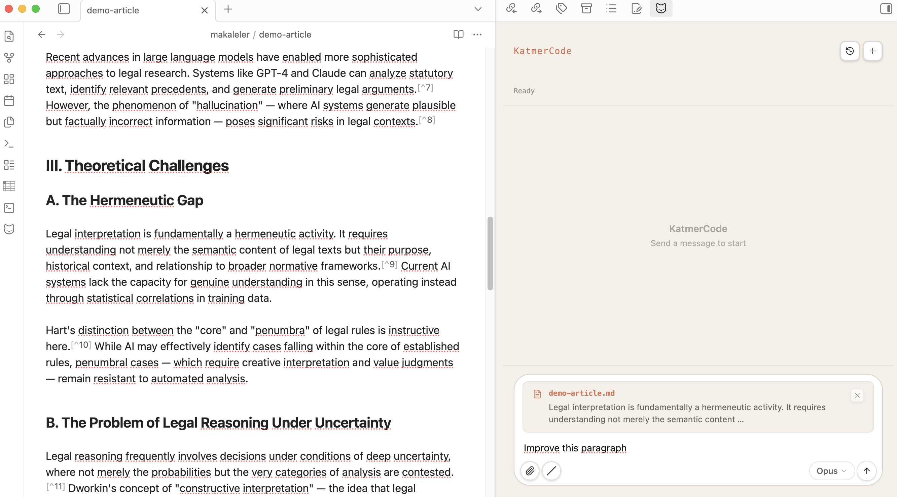
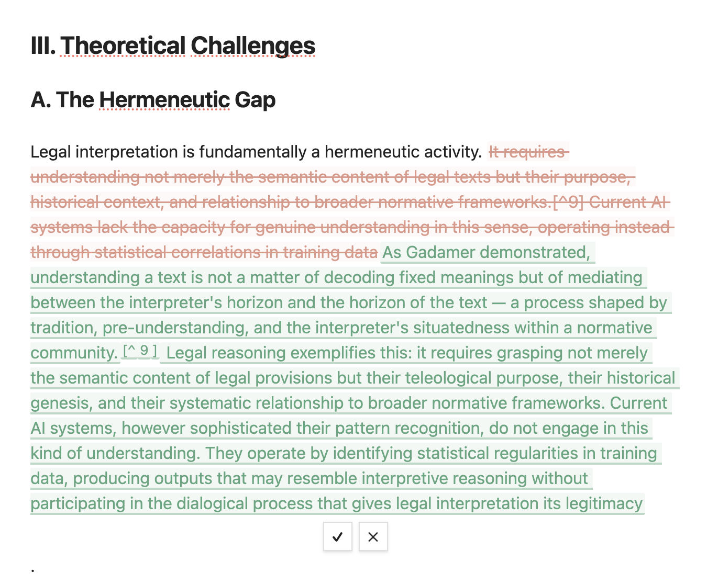
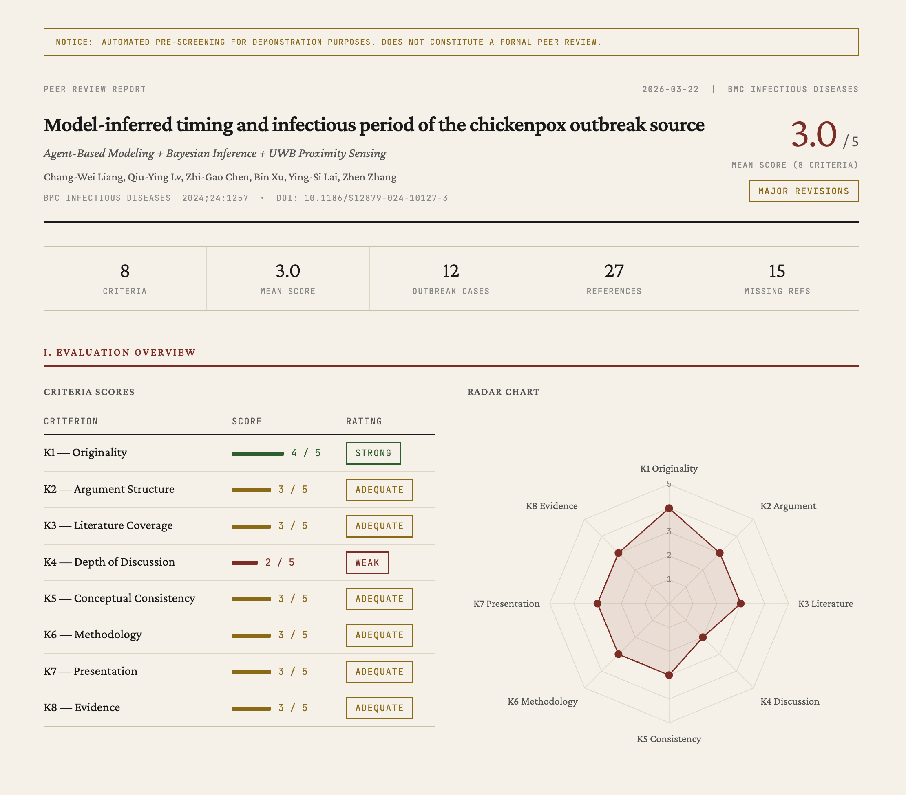
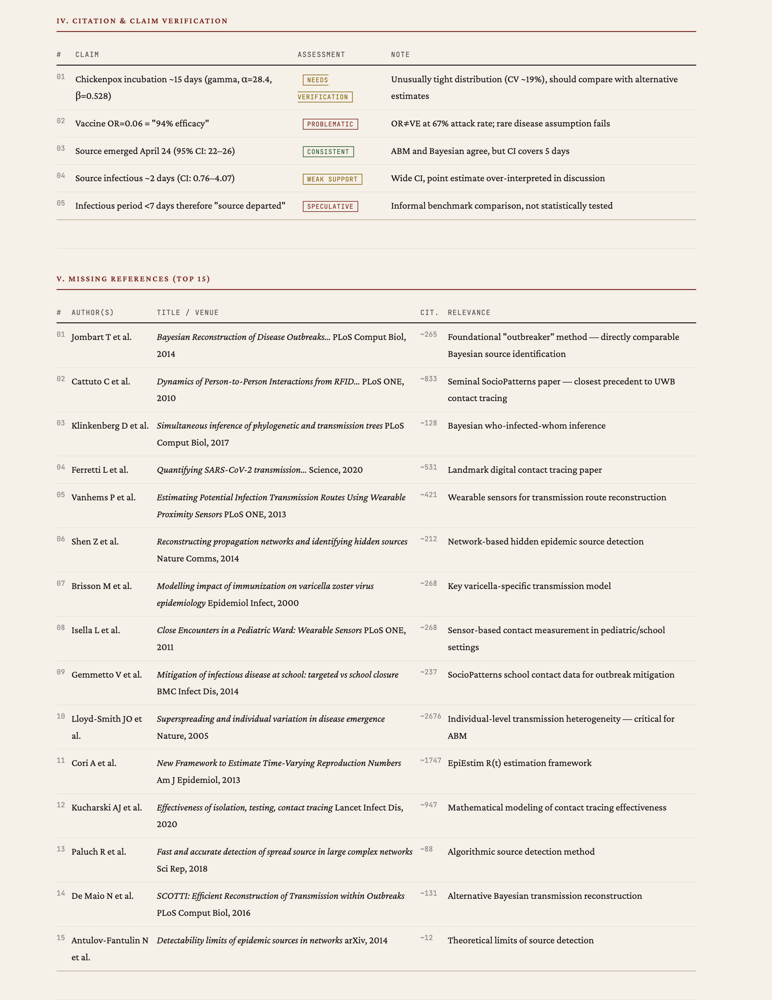
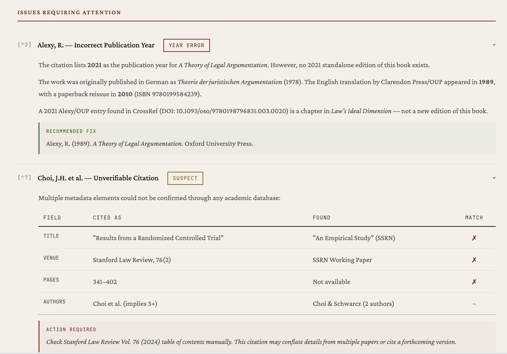
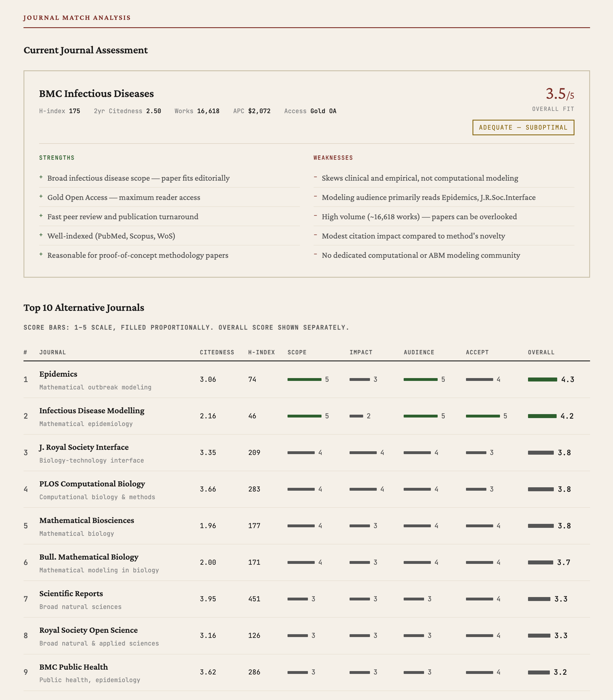
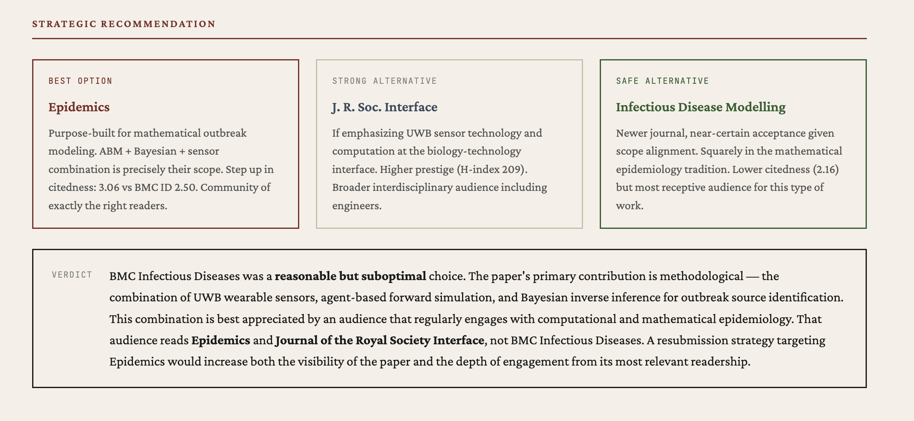
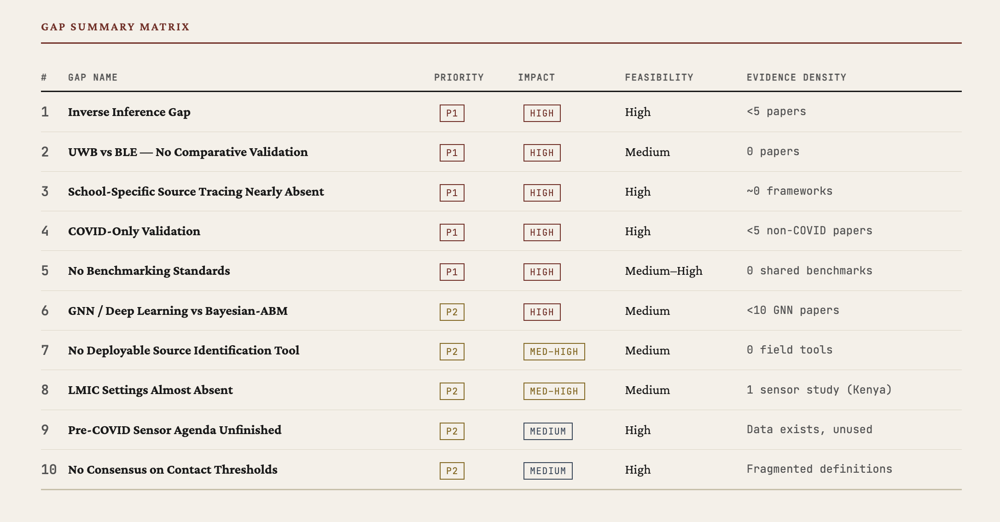
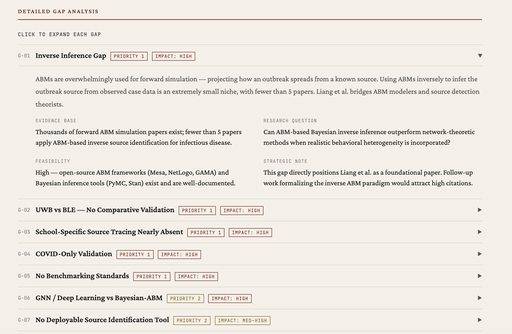
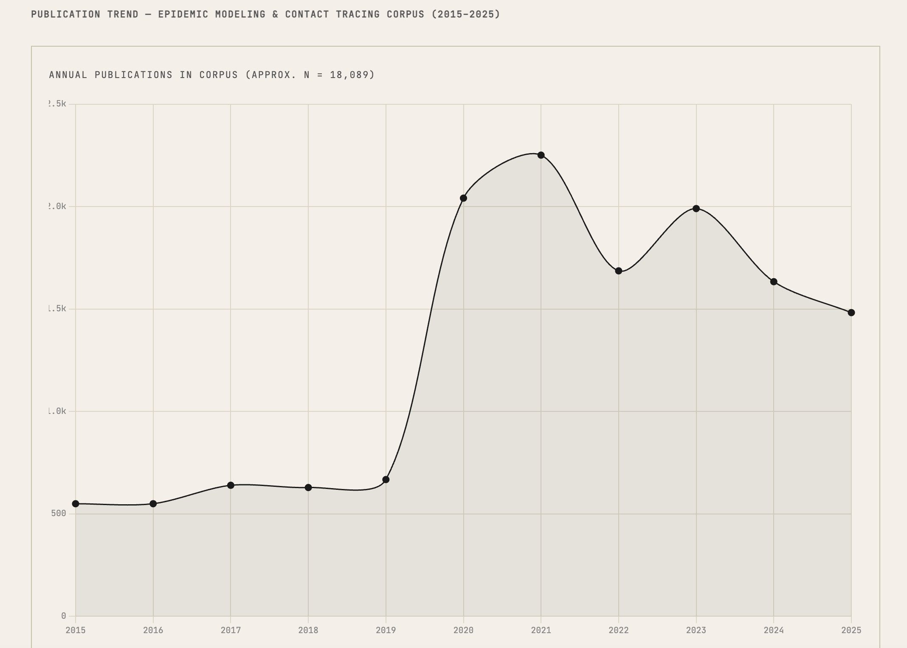

# KatmerCode

Claude Code inside Obsidian — with academic research skills, inline diff editing, and MCP support.

[](https://obsidian.md)
[](LICENSE)
[]()

An Obsidian plugin that integrates Claude Code as a sidebar chat panel. Built for researchers who write in Obsidian and want AI assistance for literature review, citation checking, manuscript editing, and peer review — without leaving their editor.

Ships with **7 academic research skills** that work as slash commands. **Desktop only** (requires Claude Code CLI).



---

## Quick Start

1. Install Claude Code: `npm install -g @anthropic-ai/claude-code` then run `claude` to log in
2. Clone and build: `git clone https://github.com/hkcanan/katmer-code.git && cd katmer-code && npm install && npm run build`
3. Copy `main.js`, `manifest.json`, `styles.css` into `<your-vault>/.obsidian/plugins/katmer-code/`
4. Enable **KatmerCode** in Obsidian → Settings → Community Plugins
5. For academic skills: Settings → KatmerCode → toggle skills on + enable **Allow Web Requests**

---

## What It Does

- Runs Claude Code inside Obsidian (via [Agent SDK](https://docs.anthropic.com/en/docs/claude-code/sdk))
- Edits your manuscripts with **inline diff** — word-level track changes in the editor (accept/undo)
- Generates **HTML research reports** (peer review, citation analysis, gap analysis) viewable inside Obsidian
- Connects to your **MCP servers** — any server configured in `~/.claude.json` works automatically
- Supports `/compact`, tabs, session resume, streaming, and everything Claude Code terminal can do

---

## Screenshots

### Chat Panel


_Text selection auto-attaches as context. Tool calls, thinking blocks, and streaming text in the sidebar._

### Inline Diff Editing


_Word-level track changes — red strikethrough for removed text, green underline for additions. Accept (✓) or undo (✕)._

### Peer Review Report


_`/peer-review` generates an HTML report with 8 criteria scores, radar chart, and detailed evaluation._

### Citation Verification & Missing References


_Claim-level verification with assessment badges. Missing references ranked by citation count and relevance._

---

## Academic Skills

Enable from **Settings → KatmerCode → Academic Skills**. Each skill installs as a slash command.

> **A note on expectations:** These skills are research aids, not oracles. They query real academic databases (Semantic Scholar, CrossRef, OpenAlex, Unpaywall, arXiv, PubMed) and apply structured analysis — but the outputs are starting points, not final verdicts. A `/peer-review` report won't replace a human reviewer. A `/cite-verify` run may flag a valid reference as unverified if the database lacks coverage. The value is in surfacing things you might miss: a gap in the literature you hadn't considered, a highly-cited paper absent from your references, or a structural weakness in your argument that's easier to see when laid out in a table. Use the reports as a map, not as the territory.

### How the skills work

1. **You provide a manuscript** — either the active file, a file path, or selected text.
2. **Claude reads and analyzes it** — parsing structure, extracting claims, identifying references.
3. **APIs are queried** — the skill calls academic databases to cross-check, search, or enrich.
4. **An HTML report is generated** — with tables, charts, and actionable findings.
5. **The report opens in Obsidian** — or in your browser, your choice.

For longer tasks (peer review with citation verification, research gap analysis), Claude uses **subagents** — parallel workers that handle different parts of the analysis simultaneously.

### Available skills

| Command             | What it does                                                                                                                                                                                  | Typical use case                                        |
| ------------------- | --------------------------------------------------------------------------------------------------------------------------------------------------------------------------------------------- | ------------------------------------------------------- |
| `/peer-review`      | Evaluates your manuscript across 8 criteria (originality, argument structure, literature coverage, methodology, etc.). Produces a radar chart and section-by-section feedback.                | Before submitting: "What would a reviewer likely flag?" |
| `/cite-verify`      | Checks every reference against CrossRef, Semantic Scholar, and OpenAlex. Flags mismatches in author names, years, or titles. Tests whether cited claims are actually supported by the source. | After drafting: "Are my citations accurate?"            |
| `/lit-search`       | Searches arXiv, Semantic Scholar, PubMed, and OpenAlex in parallel. Deduplicates results and ranks by relevance.                                                                              | Starting a new project: "What's been published on X?"   |
| `/citation-network` | Builds an interactive citation graph (vis.js) showing who cites whom. Includes a timeline view.                                                                                               | Understanding a field: "How do these papers relate?"    |
| `/research-gap`     | Identifies temporal, methodological, thematic, and application gaps in the literature. Scores each gap by feasibility and potential impact.                                                   | Planning research: "Where are the opportunities?"       |
| `/journal-match`    | Analyzes your manuscript's reference profile and suggests target journals based on where your cited sources are published.                                                                    | Ready to submit: "Which journal fits this paper?"       |
| `/abstract`         | Generates abstracts in 5 formats: structured, narrative, graphical description, highlights, and social media summary.                                                                         | Finalizing: "Write me a structured abstract."           |

### Skill outputs

#### `/cite-verify` — Citation verification


_Each reference is checked against CrossRef, Semantic Scholar, and OpenAlex. Issues flagged with assessment badges — year errors, suspect citations, recommended fixes._

#### `/journal-match` — Journal recommendations


_Top 10 journals scored on scope, impact, audience, and acceptance. Current journal assessed with strengths/weaknesses._


_Strategic recommendation with best option, strong alternative, and safe alternative — each with reasoning._

#### `/research-gap` — Gap analysis


_Gaps ranked by priority and impact. Evidence density shows how underexplored each area is._


_Each gap includes evidence base, research question, feasibility assessment, and strategic note._


_Publication trend chart shows field activity over time — useful for identifying emerging or declining areas._

### Report design

All skills produce HTML reports with a shared design system:

- **Crimson Pro** serif typography (academic book aesthetic)
- **Chart.js** for radar charts, bar charts, timelines
- **Alpine.js** for collapsible sections and interactive elements
- Consistent color palette, table styles, and badge system across all report types

Reports open inside Obsidian (iframe viewer) or in your default browser. A notification appears automatically when a new report is generated.

### A practical example

Say you've drafted a paper on AI in legal reasoning. Here's one way to use the skills:

1. `/peer-review makaleler/demo-article.md` — get a structured evaluation before asking colleagues
2. Review the radar chart — notice "Literature Coverage" scored low
3. `/lit-search AI legal reasoning hermeneutics` — find papers you may have missed
4. `/cite-verify makaleler/demo-article.md` — check that all 14 references are accurate
5. `/journal-match makaleler/demo-article.md` — see which journals publish similar work
6. Edit your manuscript based on the findings, then run `/peer-review` again

No single run gives you a definitive answer. But each one shows you something you might not have seen on your own.

---

## Requirements

- **Obsidian** 1.4.0+ (desktop only — macOS, Windows, or Linux)
- **Claude Code CLI** installed and logged in
- **Claude account** with API access

```bash
npm install -g @anthropic-ai/claude-code
claude  # log in once
```

## Installation

### Build from source

```bash
git clone https://github.com/hkcanan/katmer-code.git
cd katmer-code
npm install
npm run build
```

This produces three files in the project root: `main.js`, `manifest.json`, and `styles.css`.

Copy all three into your vault:

```bash
mkdir -p <your-vault>/.obsidian/plugins/katmer-code
cp main.js manifest.json styles.css <your-vault>/.obsidian/plugins/katmer-code/
```

Then enable **KatmerCode** in Obsidian → Settings → Community Plugins.

---

## Configuration

| Setting            | Default      | Description                                                    |
| ------------------ | ------------ | -------------------------------------------------------------- |
| CLI Path           | `claude`     | Auto-detected. Set manually if needed.                         |
| Working Directory  | vault root   | Where Claude sessions run.                                     |
| Default Model      | Sonnet       | Opus, Opus 1M, Sonnet, or Haiku                                |
| Permission Mode    | Accept Edits | Auto-approve file edits only                                   |
| Allow Web Requests | Off          | Needed for academic skills (enables WebFetch, WebSearch, curl) |

### MCP Servers (optional)

The plugin inherits MCP servers from your Claude Code config (`~/.claude.json`). Nothing extra to configure — if you've set up MCP servers for your terminal Claude Code, they work here too.

These are **not required** but can speed up academic skills if installed:

- [paper-search-mcp](https://github.com/openags/paper-search-mcp) — 20+ academic databases in one server
- [arxiv-mcp-server](https://github.com/blazickjp/arxiv-mcp-server) — arXiv with full-text PDF reading
- [openalex-research-mcp](https://github.com/oksure/openalex-research-mcp) — Citation analysis, trends, journal quality

Without MCP servers, skills use WebFetch to call APIs directly. This works fine — MCP servers just make it faster and use fewer tokens.

---

## How It Works

```
Obsidian
├── Editor (with inline diffs)
├── KatmerCode Chat (sidebar)
│   └── Agent SDK → Claude Code CLI subprocess
│       ├── Tools (Read, Edit, Write, Bash, Grep...)
│       ├── MCP servers (from your config)
│       └── Skills (~/.claude/commands/)
└── Report Viewer (iframe)
```

Skills are `.md` prompt files installed to `~/.claude/commands/` when you enable them in settings. They work both in the plugin and in your terminal.

---

## License

[MIT](LICENSE)

## Contributing

Issues and PRs welcome. This is a side project — built by a researcher, for researchers.
